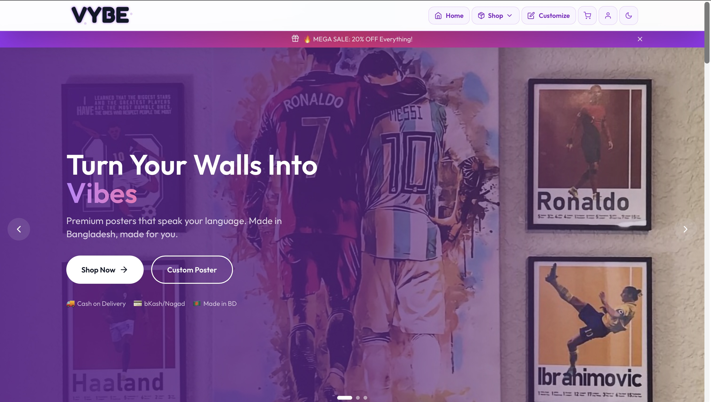
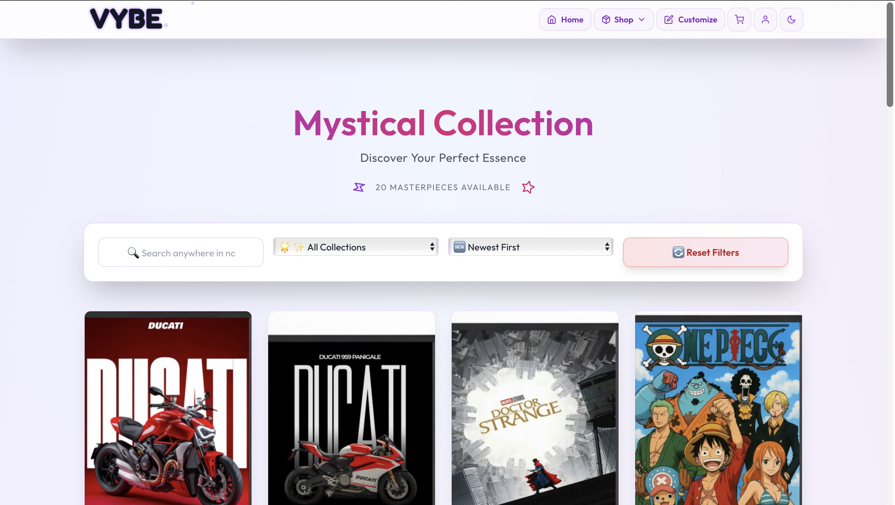
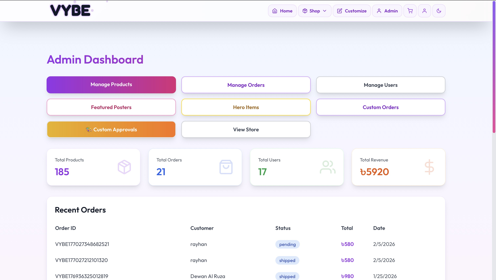
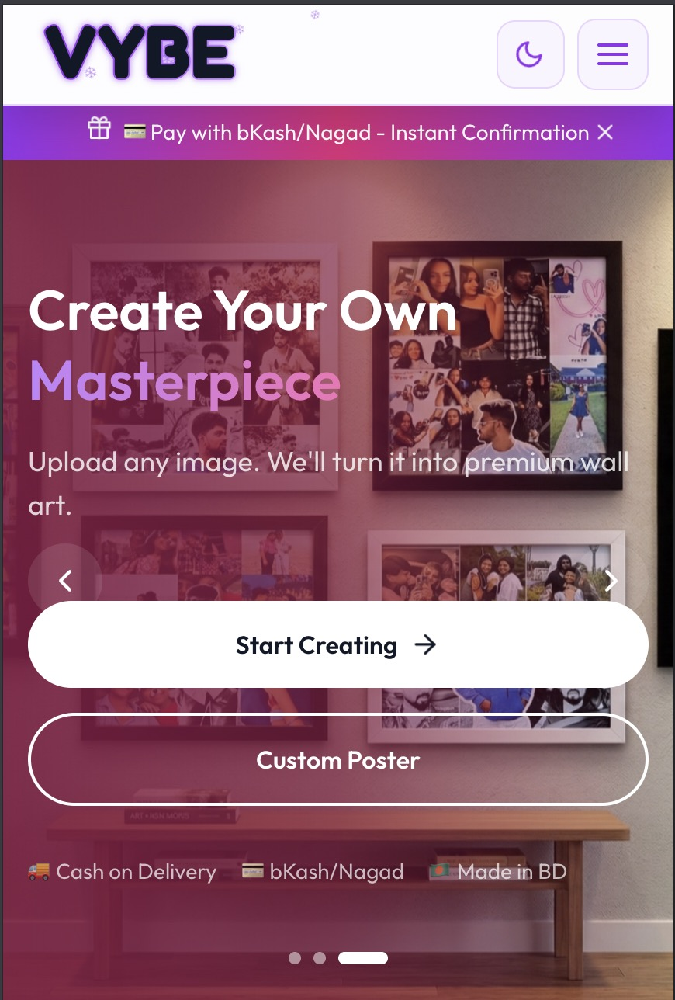
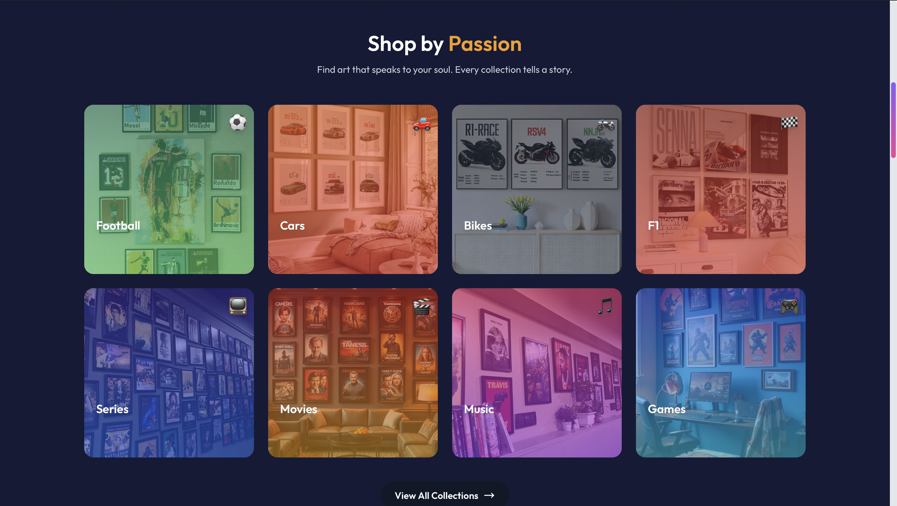
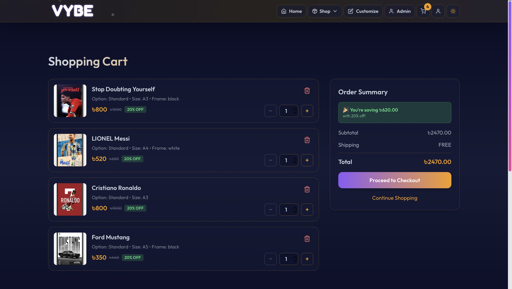

<div align="center">

# 🎨 VYBE

### A Modern E-Commerce Platform for Customizable Posters

[](https://vybebd.store)
[](https://reactjs.org/)
[](https://nodejs.org/)
[](https://www.mongodb.com/)
[](https://tailwindcss.com/)

<p align="center">
  <strong>A full-stack MERN application featuring product customization, real-time cart updates, admin dashboard, and mobile payment integration (bKash, Nagad, Rocket).</strong>
</p>

[Features](#-features) • [Tech Stack](#-tech-stack) • [Installation](#-installation) • [Screenshots](#-screenshots) • [API Reference](#-api-reference) • [Contributing](#-contributing)

</div>

---

## ✨ Features

<table>
<tr>
<td width="50%">

### 🛍️ Customer Experience
- **Product Browsing** with search & filtering
- **Product Customization** - Upload images, add text, choose frames
<div align="center">

# 🎨 VYBE

### Custom Poster E‑Commerce Platform for Bangladesh (MERN + Firebase)

[](https://vybebd.store)
[](https://reactjs.org/)
[](https://nodejs.org/)
[](https://www.mongodb.com/)
[](https://tailwindcss.com/)

<p align="center">
  <strong>Production-ready MERN e‑commerce store where users in Bangladesh can browse, customize, and order premium posters with secure phone‑OTP checkout.</strong>
</p>

[Overview](#-overview) • [Features](#-features) • [Tech Stack](#-tech-stack) • [Screenshots](#-screenshots) • [Architecture](#-architecture) • [Getting Started](#-getting-started) • [Author](#-author)

</div>

---

## 🧾 Overview

VYBE is a full‑stack e‑commerce platform focused on **custom poster printing for Bangladeshi customers**.

It is built and deployed as a real production project, with:

- End‑to‑end **MERN architecture** (MongoDB, Express, React, Node.js)
- **Firebase Phone Auth** for OTP‑based checkout (Bangladesh +880 support)
- Optimized **performance and UX** for slower mobile networks
- Clean, mobile‑first UI and a checkout flow designed for non‑technical users

Live site: **https://vybebd.store**

---

## ✨ Features

### 🛍️ Customer Experience
- Browse curated posters with categories (football, anime, cars, F1, music, etc.)
- Customize posters (image / text) before ordering
- Cart and "Buy Now" flows with real-time updates
- Mobile‑first, responsive layout with smooth interactions

### 🔐 Checkout & Security
- **Firebase Phone OTP verification** for Bangladeshi numbers (+880)
- Robust error handling (25+ Firebase error codes covered)
- Protection against accidental page refresh during OTP and checkout
- Secured backend with layered middleware (validation, rate limiting, sanitization, JWT)

### ⚡ Performance & Reliability
- Code‑splitting with `React.lazy` and Suspense skeleton loaders
- Optimized bundle size and faster initial load
- Image delivery via Cloudinary
- Deployed with CI‑style flow (GitHub → Vercel / Railway)

---

## 🛠️ Tech Stack

**Frontend**
- React 18, Vite, React Router
- Tailwind CSS
- React Query / custom hooks for data fetching

**Backend**
- Node.js, Express
- MongoDB Atlas (Mongoose)
- Firebase Admin SDK (phone auth verification)

**Cloud & Services**
- Vercel (frontend)
- Railway (backend API)
- Cloudinary (image storage)

---

## 📸 Screenshots

<div align="center">

| Desktop View |  |  |
|:---:|:---:|:---:|
|  |  |  |
| **Homepage** | **Shop** | **Admin** |

| Mobile & Features |  |  |
|:---:|:---:|:---:|
|  |  |  |
| **Mobile** | **Dark Mode** | **Cart** |

</div>

---

## 🏗️ Architecture

High-level structure (code details are intentionally kept minimal here; see the repo if you want to dive deeper):

```bash
VYBE/
├── frontend/  # React frontend (Vite + Tailwind)
├── backend/   # Express backend (API, security, Firebase Admin)
└── docs/      # Internal documentation & deployment guides
```

Key decisions:

- Clear separation of **frontend** and **backend** responsibilities
- OTP flow implemented with both **client‑side Firebase SDK** and **server‑side Admin SDK**
- Hardened backend with dedicated security middleware

---

## 🚀 Getting Started (For Local Use)

This is a **portfolio project**, not an open-source library. The code is public for learning and review, but external contributions and PRs are not accepted.

### Prerequisites

- Node.js 18+
- MongoDB Atlas account
- Firebase project (Phone Auth enabled)
- Cloudinary account (for images)

### 1. Clone & Install

```bash
git clone https://github.com/ray37han/Vybebd.git
cd VYBE

# Backend
cd backend
npm install

# Frontend
cd ../frontend
npm install
```

### 2. Environment Variables (high level)

Backend `.env` (backend):

- `MONGODB_URI` – MongoDB connection string
- `JWT_SECRET` – secret for auth tokens
- Firebase Admin / service account configuration
- Cloudinary + email settings (see docs for full list)

Frontend `.env` (frontend):

- `VITE_API_URL` – API base URL (e.g. `https://api.vybebd.store/api` or local `http://localhost:5001/api`)
- `VITE_FIREBASE_*` – Firebase client SDK keys for Phone Auth

### 3. Run in Development

```bash
# Backend
cd backend
npm run dev

# Frontend (new terminal)
cd frontend
npm run dev
```

---

## 👤 Author

**Rakibul Hasan Rayhan**

- GitHub: https://github.com/Ray37han
- LinkedIn: www.linkedin.com/in/rakibul-hasan-rayhan-906b22335

If you’re reviewing this as part of my portfolio, feel free to reach out on LinkedIn for a walkthrough of the architecture, Firebase OTP flow, or deployment setup.

---

<div align="center">

⭐ If you like this project, you’re welcome to star the repo.

[🌐 Live Site](https://vybebd.store)

</div>
